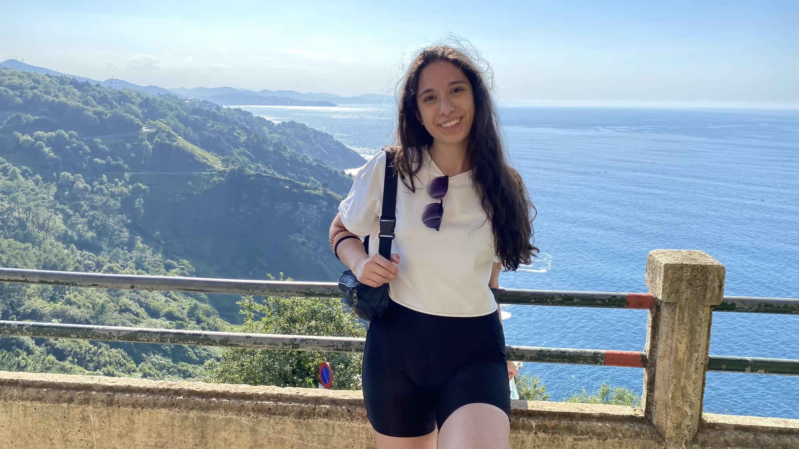

<!-- (comment) the image below can be found in img folder of this very project-->
<!--{: style="float: right; margin: 0px 20px; width: 180px;" name="fox"}-->
<!--{: style="float: right; margin: 0px 20px; width: 180px;" name="fox"}-->
{: style="float: right; margin: 0px 20px; width: 250px; border-radius: 50%" name="fox"}

<!--  -->

🏻‍💻 I'm an NLP Master student at the University of the Basque Country and a graduate translator and interpreter for English & German into Spanish.

🔬 My research interests are in bridging vision and language modalities and Self-Supervised Learning!

📚 I'm currently working on my Master's thesis in the field of Retrieved Augmented Generation for the recovery and preservation of historical memory, culture and traditions in rural Spain.

