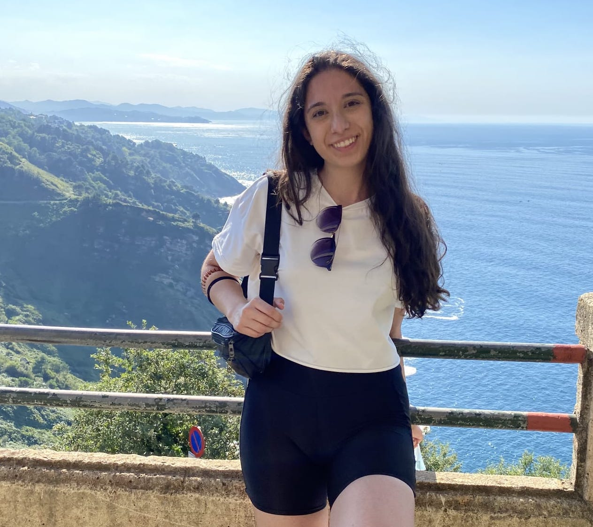

<!-- (comment) the image below can be found in img folder of this very project-->
<!--{: style="float: right; margin: 0px 20px; width: 180px;" name="fox"}-->
<!--{: style="float: right; margin: 0px 20px; width: 180px;" name="fox"}-->
{: style="float: right; margin: 0px 30px; width: 300px; border-radius: 30%" name="fox"}

<!--  -->

💻 I'm an NLP Master student at the University of the Basque Country and a graduate translator and interpreter for English & German into Spanish.

🔬 My current research interests are Machine Translation & Evaluation and latest NLP applications!

✏️ I'm currently working on my Master's thesis in the field of Retrieved Augmented Generation for the recovery and preservation of historical memory, culture and traditions in rural Spain.

# Selected Experience

## ⚙️ Industry
After working in various roles as an EN/DE>ES-es translator, I completed an internship at dSPACE as a Machine Translation Evaluation Consultant, where I began my journey into coding.

In September 2024, I will start an internship at the Advanced Language Solutions Section at CdT. Looking forward to it!

## 💡 Academy 
As a student research assistant, I learnt about Hate Speech Detection and the potential role of gaze features in improving hate speech detection models under the supervision of [Özge Alaçam's](!https://ozgealacam.com/) in the Gaze4Hate project. 

## 💭 Open Source Contributions
[LaSolanaNews](!https://www.kaggle.com/datasets/mgabve/lasolananews) is a labeled collection of over 1000 news articles about the city of La Solana. Learn more on Kaggle!
